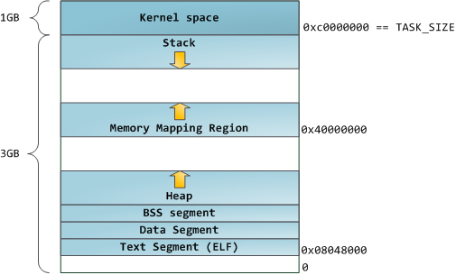
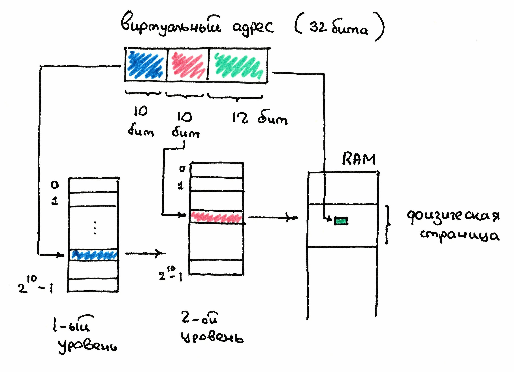
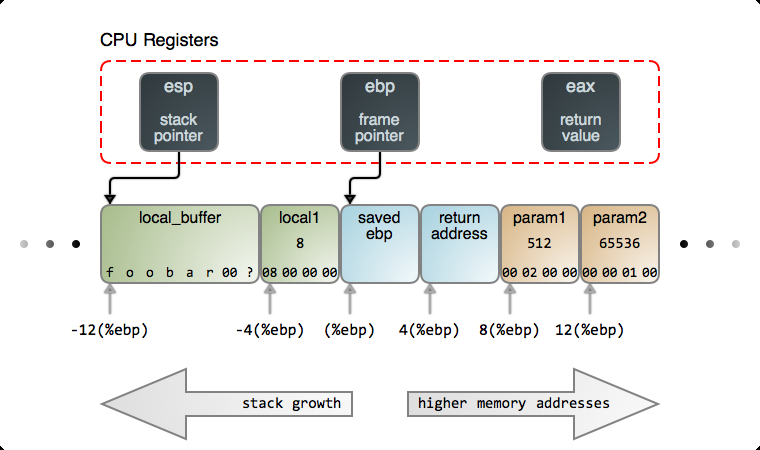
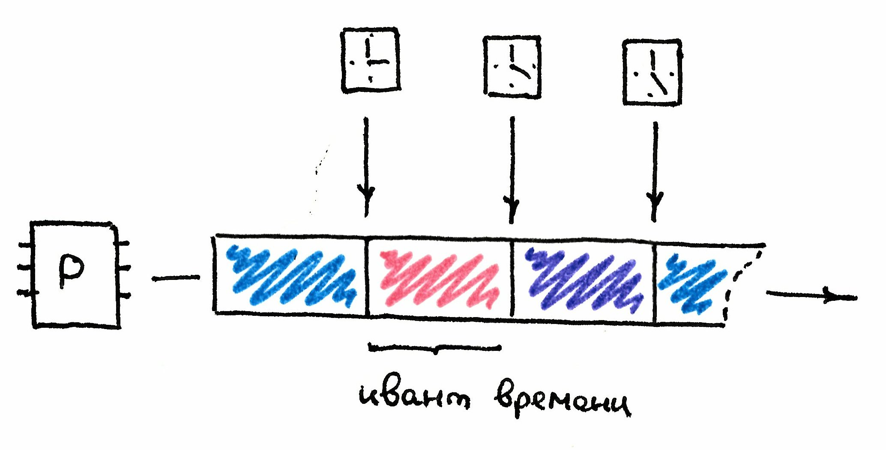
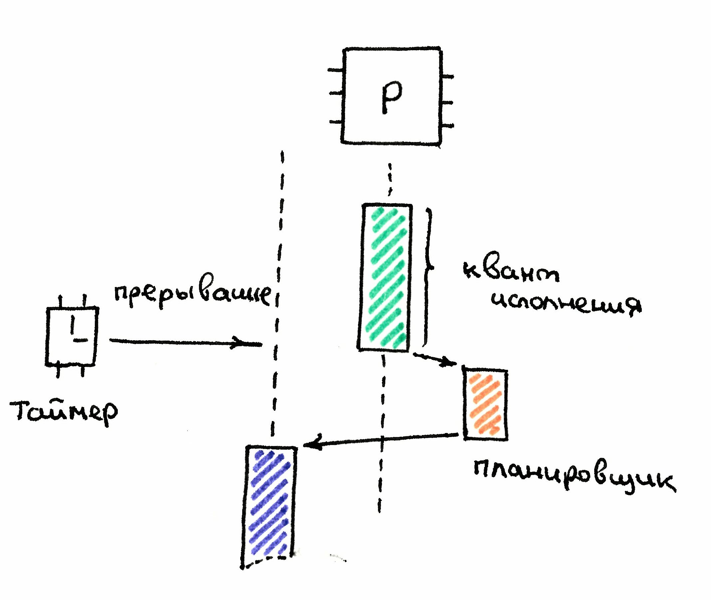

# Ликбез по операционным системам

## Процесс

**Процесс** (process) – это абстракция запущенной программы.
Процесс создается в операционной системе после запуска программы.

## Виртуальная память

Физическая память может состоять из нескольких модулей, иметь сложную топологию и схему адресации.

Процессы работают с памятью не напрямую, а через слой абстракции – **виртуальную память**.

Виртуальная память с точки зрения программы – это плоская непрерывная память, в которой для адресации достаточно одного целого числа – смещения от начала, т.е. простого индекса.

Диапазон виртуальных адресов называют **виртуальным адресным пространством**.

Задачу отображения виртуальной памяти на физическую берут на себя операционная система и процессор. Программа полностью изолирована от этой машинерии!
Она работает с простой плоской моделью памяти и простой схемой адресации.

Размер виртуальной памяти не зависит от доступной физической памяти и определяется только **разрядностью процессора**, т.е. максимальным адресом, который помещается в машинное слово.
Для 32-битных процессоров – **4 гигабайта**.
Для 64-битных – **16 эксабайт** в теории, на практике для адресации используется меньшее число бит (42/48).

Механизм виртуальной памяти обеспечивает изоляцию процессов в операционной системе:
Код одного процесса не может изменять данные в памяти другого процесса, поскольку каждый из процессов работает со своей
независимой виртуальной памятью.
Виртуальная память – как песочница, в которой копается процесс.

## Сегменты памяти

Виртуальное адресное пространство разделено на логические сегменты: код, данные, стеки, хип и т.п.

* В сегменте кода находятся скомпилированный код программы, т.е. машинные инструкции, которые будет исполнять процессор.
* В сегменте стека – стеки всех потоков программы.
* В хипе находятся данные, которые потоки производят во время работы программы. Память в хипе программа получает от аллокатора.

Ниже представлена структура памяти процесса для x86.

{ width=50% }

## Сегменты памяти

На разные сегменты настроены разные права доступа: потоки не могут писать в сегмент кода, зато могут писать в сегмент хипа или стеков.
Потоки коммуницируют через память **стеков** и **хипа (кучи)**.
Для этого каждый поток должен иметь указатель/ссылку на общие данные.

## Виртуальные и физические адреса

Программа оперирует только виртуальными адресами.

Например, на стеке хранится указатель на голову списка, т.е. виртуальный адрес динамической памяти, по этому адресу в динамической памяти находится блок с данными и виртуальный адрес следующего узла списка. Программа не заботится о том, как эти блоки в действительности распределены по микросхемам памяти.
Процессор при выполнении инструкций должен транслировать эти виртуальные адреса в физические.

Виртуальное адресное пространство нарезано на блоки фиксированного размера – **страницы памяти**.
Виртуальная память отображается на физическую **постранично**: странице виртуального адресного пространства соответствует страница физической памяти.
Непрерывный диапазон страниц в виртуальном адресном пространстве не означает, что соответствующая физическая память тоже выделена непрерывным блоком.

Физические страницы выделяются по требованию:
Во время первого обращения к виртуальной странице происходит прерывание **page fault**, процессор переключается на операционную систему, и та выделяет физическую страницу. Если page fault возник при чтении из сегмента кода, то операционная система загружает в выделенную физическую страницу код программы с диска.

## Трансляция виртуальных адресов
У каждого процесса есть поисковый индекс, который хранит отображение страниц виртуального адресного пространства в физические адреса – **таблицы страниц**.

{ width=50% }

Таблица страниц располагается в оперативной памяти. Обращаться к ней напрямую – слишком медленно для процессора.
Поэтому в процессоре реализован кэш для трансляции адресов горячих страниц памяти: **TLB** (_translation lookaside buffer_).

## Поток исполнения

**Поток исполнения** (_thread of execution_) – это последовательность инструкций, которую исполняет процессор.
Потоки живут в контексте одного процесса и работают с общей виртуальной памятью через сегменты хипа и стека. **Синонимы:** поток, тред, нить.

Для исполняемого потока процессор хранит в служебных регистрах специальные адреса:
* instruction pointer (IP) или program counter (PC) –
адрес инструкции в сегменте кода, которую нужно
исполнить следующей.
*stack pointer и frame pointer – указатель на вершину
стека и на точку отсчета последнего стекового фрейма
текущего потока в сегменте стека.

## Стековый фрейм на x86
{ width=50% }

## Планирование потоков

Несколько потоков могут исполняться на одном процессоре с помощью механизма разделения времени (time sharing ):
Планировщик выдает каждому потоку небольшой промежуток времени на исполнение – квант времени (quantum или time slice).

После того, как квант времени истекает, планировщик либо дает потоку еще один квант (если нет потоков, ждущих в очереди на исполнение), либо останавливает текущий поток, помещает его в очередь на исполнение и выбирает новый поток для исполнения.

{ width=50% }

## Реализация

Системный таймер с фиксированной частотой посылает процессору сигнал – **прерывание** (_interrupt_).

Получив прерывание от системного таймера, процессор останавливает выполнение текущего потока и исполняет системный код, в котором и вызывается планировщик.

Планировщик увеличивает счетчик тиков текущего потока. Если этот счетчик превысил квант времени, выданный текущему потоку на исполнение, то планировщик снимает его с процессора и запускает новый поток из числа ожидающих исполнения.

{ width=50% }

## Причины переключений

* Истек квант времени, выделенный потоку на исполнение.
* Поток заблокирован системным механизмом синхронизации, например, в момент захвата системного мьютекса.
* Поток выполняет блокирующий системный вызов, например, читает данные из сетевого соединения или с диска.
* Поток сам готов уступить процессор для исполнения другому потоку с помощью вызова sleep или yield.

## Виды переключений

* Принудительное: переключение по истечению кванта времени.
Поток готов продолжать работу, но прерывается планировщиком.
* Добровольное: переключение во время блокирующих системных вызовов.
Потоку нужно дождаться некоторого события (освобождения мьютекса, завершения чтения с диска), и на время ожидания он готов уступить процессор потоку, который стоит в очереди на исполнение.

## Context switch

При переключении нужно сохранить состояние текущего потока (instruction pointer, stack pointer и другие регистры процессора) и симметрично восстановить состояние нового потока.
В случае переключения на поток другого процесса нужно переключить виртуальное адресное пространство: сменить таблицы страниц и сбросить кэш трансляции.

## Переключение потоков

Переключение процессора с потока на поток сводит на нет различные низкоуровневые процессорные оптимизации:

* Сбрасывается конвейер процессора, который параллелит разные этапы выполнения инструкций.
* Сбрасывается кэш трансляции виртуальных страниц.
* Протухает содержимое локальных кэшей процессора, в которых хранились горячие данные, которые использовал поток

Мораль: переключение потока – дорогая операция!

Планировщик работает реактивно – перепланирование происходит как реакция на системные вызовы и тики системного таймера.

## Переключения с точки зрения потока

Поток не может предсказать момент следующего своего переключения, переключение может произойти после каждой машинной инструкции.
Поток не может даже наблюдать собственные переключения.
Непредсказуемые переключения – главная сложность многопоточного программирования.
Логика исполнения программы становится сильно нелинейной, с ростом потоков число вариантов исполнения экспоненциально возрастает.

## Главное про планирование потоков
* **Планировщик** распределяет потоки по процессорам и переключает их.

* Каждому потоку на исполнение дается небольшой квант времени, после чего планировщик может переключить его на другой поток.
* Переключение потоков происходит через ядро.
* Моменты переключения потоков непредсказуемы, переключение может случиться после каждой инструкции. 
